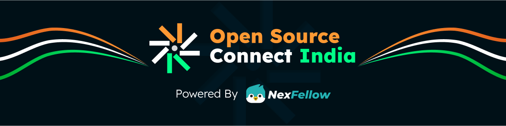

<p align="center">
  
</p>

<h1 align="center">🩸 RAKTDAAN</h1>

<p align="center">
  <strong>Where You Bond By Blood</strong><br/>
  <em>A real-time blood donation platform connecting donors, recipients, and hospitals — saving lives, one drop at a time.</em>
</p>

<p align="center">
  <a href="https://raktdaanorg.netlify.app/">
    
  </a>
  &nbsp;
  
  &nbsp;
  
  &nbsp;
  
  &nbsp;
  
</p>

---

## 📌 Table of Contents

- [Overview](#-overview)
- [Live Demo](#-live-demo)
- [Key Features](#-key-features)
- [Tech Stack](#-tech-stack)
- [Getting Started](#-getting-started)
- [Project Structure](#-project-structure)
- [Development Scripts](#-development-scripts)
- [Security](#-security)
- [Contributing](#-contributing)
- [License](#-license)

---

## 🌟 Overview

**RAKTDAAN** is a comprehensive, real-time blood donation platform designed to bridge the critical gap between **donors**, **recipients**, **hospitals**, and **administrators**. Built with cutting-edge technologies and engineered for urgency, reliability, and simplicity — it ensures that no life is lost due to delayed access to blood.

> 💡 *"One unit of blood can save up to three lives. Be the reason someone lives. Be a donor. Be a hero."*

---

## 🚀 Live Demo

<p align="center">
  <a href="https://raktdaanorg.netlify.app/">
    <strong>👉 Visit Live Site → raktdaanorg.netlify.app</strong>
  </a>
</p>

---

## 🎯 Key Features

### 🧑‍💉 For Donors
| Feature | Description |
|---------|-------------|
| 🔐 Secure Registration | Complete donor profile with ID verification |
| 📍 Real-time Availability | Location-based status updates and availability toggle |
| 📋 Donation History | Track past donations and eligibility status |
| 🔔 Live SOS Alerts | Instant notifications for nearby emergency requests |
| 📎 Document Upload | Submit ID proofs and donation certificates |
| ✅ Verified Status | Admin-approved donor verification badge |

### 🏥 For Hospitals
| Feature | Description |
|---------|-------------|
| 🚨 Emergency SOS System | Create and manage urgent blood requests |
| 🩸 Inventory Management | Track blood bank levels and requirements |
| 🔍 Smart Donor Matching | Filter by blood group, location, and availability |
| 📊 Request Tracking | Real-time status monitoring for all blood requests |
| 🏛️ Verification System | Hospital registration with admin approval workflow |

### 🛡️ Admin Dashboard
| Feature | Description |
|---------|-------------|
| 👥 User Management | Verify and manage donor/hospital registrations |
| 🎯 Team Management | Role-based access control (Member, Moderator, Lead) |
| 📈 System Analytics | Real-time statistics and engagement metrics |
| 📄 Document Verification | Review and approve ID documents and certificates |
| 🏢 Department Organization | Group team members by departments |
| 📡 Activity Monitoring | Track system usage and user behavior |

### 🚨 Emergency & Alert System
- **GPS-powered Matching** — Location-based donor-recipient proximity detection
- **Real-time Push Notifications** — Instant alerts dispatched to available donors
- **SOS Broadcasting** — Emergency alerts sent simultaneously to multiple donors
- **Response Tracking** — Monitor donor responses to active emergencies

---

## 🛠️ Tech Stack

| Layer | Technology |
|-------|-----------|
| **Frontend** | React 19, TypeScript, Vite 6, Tailwind CSS 3 |
| **Backend** | [Convex](https://www.convex.dev) — Real-time serverless backend |
| **Authentication** | Convex Auth with Firebase integration |
| **File Storage** | Firebase Storage & Convex File Storage |
| **Location Services** | Geolocation API, GPS proximity matching |
| **UI Components** | Lucide React, Framer Motion, Sonner |
| **Hosting** | Netlify (CI/CD + Live Deployment) |
| **Dev Tools** | ESLint, Prettier, npm-run-all, TypeScript |

---

## ⚡ Getting Started

### Prerequisites

Ensure you have the following installed:

- **Node.js** ≥ 18.x
- **Git**
- **Convex CLI** — `npm install -g convex`
- **Firebase CLI** *(optional, for chat & file upload features)*

### 1️⃣ Clone the Repository

```bash
git clone https://github.com/Nitesh-Singh/RAKTDAAN.git
cd RAKTDAAN
npm install
```

### 2️⃣ Configure Environment Variables

Create a `.env` file in the root directory:

```env
# Convex Backend (auto-set when you run `npx convex dev`)
VITE_CONVEX_URL=http://127.0.0.1:3210

# Firebase (Optional — for chat, file uploads, analytics)
VITE_FIREBASE_API_KEY=your_api_key
VITE_FIREBASE_AUTH_DOMAIN=your_project.firebaseapp.com
VITE_FIREBASE_PROJECT_ID=your_project_id
VITE_FIREBASE_STORAGE_BUCKET=your_project.appspot.com
VITE_FIREBASE_MESSAGING_SENDER_ID=your_sender_id
VITE_FIREBASE_APP_ID=your_app_id
VITE_FIREBASE_MEASUREMENT_ID=your_measurement_id
```

> **Note:** Copy `.env.example` as a starting point: `cp .env.example .env`

### 3️⃣ Start Development Server

```bash
npm run dev
```

This runs **both** the Vite frontend and Convex backend in parallel.

| Service | URL |
|---------|-----|
| 🌐 Frontend | http://localhost:5173 |
| ⚙️ Convex Backend | http://127.0.0.1:3210 |

---

## 📁 Project Structure

```
RAKTDAAN/
├── 📂 public/                    # Static assets and images
├── 📂 src/
│   ├── 📂 components/            # 30+ reusable UI components
│   │   ├── AdminDashboard.tsx
│   │   ├── DonorRegistration.tsx
│   │   ├── HospitalRegistration.tsx
│   │   ├── SosAlert.tsx
│   │   ├── LiveDonorAlert.tsx
│   │   ├── NotificationPopup.tsx
│   │   └── ScrollToTopButton.tsx
│   ├── 📂 firebase/              # Firebase configuration & auth
│   ├── 📂 hooks/                 # Custom React hooks
│   ├── 📂 lib/                   # Utility libraries
│   └── 📂 types/                 # TypeScript type definitions
├── 📂 convex/                    # Backend logic & database schema
│   ├── schema.ts                 # Database schema definitions
│   ├── admin.ts                  # Admin management functions
│   ├── donors.ts                 # Donor-related operations
│   ├── hospitals.ts              # Hospital management
│   ├── campaigns.ts              # Blood donation campaigns
│   ├── teams.ts                  # Team management system
│   └── fileStorage.ts            # File upload handling
├── .env.example                  # Environment variables template
├── netlify.toml                  # Netlify deployment config
├── vite.config.ts                # Vite build configuration
└── tailwind.config.js            # Tailwind CSS configuration
```

---

## 📜 Development Scripts

```bash
# Start full stack (frontend + backend in parallel)
npm run dev

# Start only Vite frontend
npm run dev:frontend

# Start only Convex backend
npm run dev:backend

# Production build
npm run build

# Netlify-specific build
npm run build:netlify

# Pre-deployment validation
npm run deploy-check

# Code linting & type checking
npm run lint
```

---

## 🔐 Security

RAKTDAAN is built with security as a first-class concern:

- **JWT Authentication** — Secure, stateless user sessions
- **Role-based Access Control** — Admin, donor, and hospital roles with strict permissions
- **Document Verification** — ID proof validation pipeline
- **Secure File Uploads** — Protected document storage with access control
- **Input Validation** — Comprehensive server-side and client-side form validation

---

## 🤝 Contributing

Contributions are warmly welcomed from developers, designers, and volunteers!

```bash
# 1. Fork the repository
# 2. Create your feature branch
git checkout -b feature/your-feature-name

# 3. Commit your changes
git commit -m "feat: add your feature description"

# 4. Push to your branch
git push origin feature/your-feature-name

# 5. Open a Pull Request
```

📬 Have questions or ideas? Open an [issue](https://github.com/Nitesh-Singh/RAKTDAAN/issues) to start a discussion.

---

## 🙏 Acknowledgments

- [Convex.dev](https://convex.dev) — Serverless backend with real-time sync
- [Firebase](https://firebase.google.com/) — Auth, storage & analytics
- [Tailwind CSS](https://tailwindcss.com/) — Utility-first CSS framework
- [Framer Motion](https://www.framer.com/motion/) — Smooth animations
- Inspired by India's [RaktDaan Amrit Mahotsav](https://www.nhm.gov.in)

---

## 📄 License

This project is licensed under the **MIT License** — see the [LICENSE](LICENSE) file for details.

---

<p align="center">
  Made with ❤️ by <a href="https://github.com/Nitesh-Singh"><strong>Nitesh Singh</strong></a>
  <br/><br/>
  <em>⭐ If this project helped you, please consider giving it a star!</em>
</p>